# Projects and dependencies analysis

This document provides a comprehensive overview of the projects and their dependencies in the context of upgrading to .NETCoreApp,Version=v10.0.

## Table of Contents

- [Executive Summary](#executive-Summary)
  - [Highlevel Metrics](#highlevel-metrics)
  - [Projects Compatibility](#projects-compatibility)
  - [Package Compatibility](#package-compatibility)
  - [API Compatibility](#api-compatibility)
  - [Binding Redirect Configuration](#binding-redirect-configuration)
- [Aggregate NuGet packages details](#aggregate-nuget-packages-details)
- [Top API Migration Challenges](#top-api-migration-challenges)
  - [Technologies and Features](#technologies-and-features)
  - [Most Frequent API Issues](#most-frequent-api-issues)
- [Projects Relationship Graph](#projects-relationship-graph)
- [Project Details](#project-details)

  - [src\host\Polaris.Abp.Host\Polaris.Abp.Host.csproj](#srchostpolarisabphostpolarisabphostcsproj)
  - [src\modules\Polaris.Abp.DatabaseManagement.Sqlite\Polaris.Abp.DatabaseManagement.Sqlite.csproj](#srcmodulespolarisabpdatabasemanagementsqlitepolarisabpdatabasemanagementsqlitecsproj)
  - [src\modules\Polaris.Abp.DatabaseManagement.SqlServer\Polaris.Abp.DatabaseManagement.SqlServer.csproj](#srcmodulespolarisabpdatabasemanagementsqlserverpolarisabpdatabasemanagementsqlservercsproj)
  - [src\modules\Polaris.Abp.DatabaseManagement\Polaris.Abp.DatabaseManagement.csproj](#srcmodulespolarisabpdatabasemanagementpolarisabpdatabasemanagementcsproj)
  - [src\modules\Polaris.Abp.Extension.Abstractions\Polaris.Abp.Extension.Abstractions.csproj](#srcmodulespolarisabpextensionabstractionspolarisabpextensionabstractionscsproj)
  - [src\modules\Polaris.Abp.PluginManagement\Polaris.Abp.PluginManagement.csproj](#srcmodulespolarisabppluginmanagementpolarisabppluginmanagementcsproj)
  - [src\modules\Polaris.Abp.ThemeManagement\Polaris.Abp.ThemeManagement.csproj](#srcmodulespolarisabpthememanagementpolarisabpthememanagementcsproj)
  - [src\samples\Abp.CmsKit\Abp.CmsKit.csproj](#srcsamplesabpcmskitabpcmskitcsproj)
  - [src\themes\Polaris.Abp.NewFireTheme\Polaris.Abp.NewFireTheme.csproj](#srcthemespolarisabpnewfirethemepolarisabpnewfirethemecsproj)
  - [test\Polaris.Abp.DatabaseManagement.Tests\Polaris.Abp.DatabaseManagement.Tests.csproj](#testpolarisabpdatabasemanagementtestspolarisabpdatabasemanagementtestscsproj)
  - [test\Polaris.Abp.TestBase\Polaris.Abp.TestBase.csproj](#testpolarisabptestbasepolarisabptestbasecsproj)

## Executive Summary

### Highlevel Metrics

| Metric | Count | Status |
| :--- | :---: | :--- |
| Total Projects | 11 | All require upgrade |
| Total NuGet Packages | 69 | 9 need upgrade |
| Total Code Files | 181 |  |
| Total Code Files with Incidents | 11 |  |
| Total Lines of Code | 6417 |  |
| Total Number of Issues | 21 |  |
| Estimated LOC to modify | 0+ | at least 0.0% of codebase |

### Projects Compatibility

| Project | Target Framework | Difficulty | Package Issues | API Issues | Binding Issues | Est. LOC Impact | Description |
| :--- | :---: | :---: | :---: | :---: | :---: | :---: | :--- |
| [src\host\Polaris.Abp.Host\Polaris.Abp.Host.csproj](#srchostpolarisabphostpolarisabphostcsproj) | net8.0 | 🟢 Low | 1 | 0 | 0 |  | AspNetCore, Sdk Style = True |
| [src\modules\Polaris.Abp.DatabaseManagement.Sqlite\Polaris.Abp.DatabaseManagement.Sqlite.csproj](#srcmodulespolarisabpdatabasemanagementsqlitepolarisabpdatabasemanagementsqlitecsproj) | net8.0 | 🟢 Low | 0 | 0 | 0 |  | ClassLibrary, Sdk Style = True |
| [src\modules\Polaris.Abp.DatabaseManagement.SqlServer\Polaris.Abp.DatabaseManagement.SqlServer.csproj](#srcmodulespolarisabpdatabasemanagementsqlserverpolarisabpdatabasemanagementsqlservercsproj) | net8.0 | 🟢 Low | 0 | 0 | 0 |  | ClassLibrary, Sdk Style = True |
| [src\modules\Polaris.Abp.DatabaseManagement\Polaris.Abp.DatabaseManagement.csproj](#srcmodulespolarisabpdatabasemanagementpolarisabpdatabasemanagementcsproj) | net8.0 | 🟢 Low | 4 | 0 | 0 |  | ClassLibrary, Sdk Style = True |
| [src\modules\Polaris.Abp.Extension.Abstractions\Polaris.Abp.Extension.Abstractions.csproj](#srcmodulespolarisabpextensionabstractionspolarisabpextensionabstractionscsproj) | net8.0 | 🟢 Low | 1 | 0 | 0 |  | ClassLibrary, Sdk Style = True |
| [src\modules\Polaris.Abp.PluginManagement\Polaris.Abp.PluginManagement.csproj](#srcmodulespolarisabppluginmanagementpolarisabppluginmanagementcsproj) | net8.0 | 🟢 Low | 1 | 0 | 0 |  | ClassLibrary, Sdk Style = True |
| [src\modules\Polaris.Abp.ThemeManagement\Polaris.Abp.ThemeManagement.csproj](#srcmodulespolarisabpthememanagementpolarisabpthememanagementcsproj) | net8.0 | 🟢 Low | 0 | 0 | 0 |  | ClassLibrary, Sdk Style = True |
| [src\samples\Abp.CmsKit\Abp.CmsKit.csproj](#srcsamplesabpcmskitabpcmskitcsproj) | net8.0 | 🟢 Low | 1 | 0 | 0 |  | ClassLibrary, Sdk Style = True |
| [src\themes\Polaris.Abp.NewFireTheme\Polaris.Abp.NewFireTheme.csproj](#srcthemespolarisabpnewfirethemepolarisabpnewfirethemecsproj) | net8.0 | 🟢 Low | 0 | 0 | 0 |  | ClassLibrary, Sdk Style = True |
| [test\Polaris.Abp.DatabaseManagement.Tests\Polaris.Abp.DatabaseManagement.Tests.csproj](#testpolarisabpdatabasemanagementtestspolarisabpdatabasemanagementtestscsproj) | net8.0 | 🟢 Low | 0 | 0 | 0 |  | DotNetCoreApp, Sdk Style = True |
| [test\Polaris.Abp.TestBase\Polaris.Abp.TestBase.csproj](#testpolarisabptestbasepolarisabptestbasecsproj) | net8.0 | 🟢 Low | 2 | 0 | 0 |  | DotNetCoreApp, Sdk Style = True |

### Package Compatibility

| Status | Count | Percentage |
| :--- | :---: | :---: |
| ✅ Compatible | 60 | 87.0% |
| ⚠️ Incompatible | 3 | 4.3% |
| 🔄 Upgrade Recommended | 6 | 8.7% |
| ***Total NuGet Packages*** | ***69*** | ***100%*** |

### API Compatibility

| Category | Count | Impact |
| :--- | :---: | :--- |
| 🔴 Binary Incompatible | 0 | High - Require code changes |
| 🟡 Source Incompatible | 0 | Medium - Needs re-compilation and potential conflicting API error fixing |
| 🔵 Behavioral change | 0 | Low - Behavioral changes that may require testing at runtime |
| ✅ Compatible | 15744 |  |
| ***Total APIs Analyzed*** | ***15744*** |  |

## Aggregate NuGet packages details

| Package | Current Version | Suggested Version | Projects | Description |
| :--- | :---: | :---: | :--- | :--- |
| coverlet.collector | 6.0.0 |  | [Polaris.Abp.DatabaseManagement.Tests.csproj](#testpolarisabpdatabasemanagementtestspolarisabpdatabasemanagementtestscsproj) | ✅Compatible |
| Microsoft.AspNetCore.Components.Web | 8.0.5 | 10.0.9 | [Abp.CmsKit.csproj](#srcsamplesabpcmskitabpcmskitcsproj) | NuGet package upgrade is recommended |
| Microsoft.AspNetCore.Http.Abstractions | 2.2.0 |  | [Polaris.Abp.PluginManagement.csproj](#srcmodulespolarisabppluginmanagementpolarisabppluginmanagementcsproj) | ⚠️NuGet package is deprecated |
| Microsoft.EntityFrameworkCore | 8.0.0 | 10.0.9 | [Polaris.Abp.DatabaseManagement.csproj](#srcmodulespolarisabpdatabasemanagementpolarisabpdatabasemanagementcsproj) [Polaris.Abp.Extension.Abstractions.csproj](#srcmodulespolarisabpextensionabstractionspolarisabpextensionabstractionscsproj) | NuGet package upgrade is recommended |
| Microsoft.EntityFrameworkCore.Design | 8.0.0 | 10.0.9 | [Polaris.Abp.DatabaseManagement.csproj](#srcmodulespolarisabpdatabasemanagementpolarisabpdatabasemanagementcsproj) | NuGet package upgrade is recommended |
| Microsoft.EntityFrameworkCore.InMemory | 8.0.0 | 10.0.9 | [Polaris.Abp.DatabaseManagement.csproj](#srcmodulespolarisabpdatabasemanagementpolarisabpdatabasemanagementcsproj) | NuGet package upgrade is recommended |
| Microsoft.EntityFrameworkCore.Tools | 8.0.0 | 10.0.9 | [Polaris.Abp.DatabaseManagement.csproj](#srcmodulespolarisabpdatabasemanagementpolarisabpdatabasemanagementcsproj) | NuGet package upgrade is recommended |
| Microsoft.Extensions.FileProviders.Embedded | 8.0.0 | 10.0.9 | [Polaris.Abp.Host.csproj](#srchostpolarisabphostpolarisabphostcsproj) | NuGet package upgrade is recommended |
| Microsoft.NET.Test.Sdk | 17.8.0 |  | [Polaris.Abp.DatabaseManagement.Tests.csproj](#testpolarisabpdatabasemanagementtestspolarisabpdatabasemanagementtestscsproj) [Polaris.Abp.TestBase.csproj](#testpolarisabptestbasepolarisabptestbasecsproj) | ✅Compatible |
| NSubstitute | 5.1.0 |  | [Polaris.Abp.TestBase.csproj](#testpolarisabptestbasepolarisabptestbasecsproj) | ✅Compatible |
| NSubstitute.Analyzers.CSharp | 1.0.16 |  | [Polaris.Abp.TestBase.csproj](#testpolarisabptestbasepolarisabptestbasecsproj) | ✅Compatible |
| Serilog.AspNetCore | 8.0.0 |  | [Polaris.Abp.Host.csproj](#srchostpolarisabphostpolarisabphostcsproj) | ✅Compatible |
| Serilog.Extensions.Hosting | 8.0.0 |  | [Polaris.Abp.PluginManagement.csproj](#srcmodulespolarisabppluginmanagementpolarisabppluginmanagementcsproj) | ✅Compatible |
| Serilog.Sinks.Async | 1.5.0 |  | [Polaris.Abp.Host.csproj](#srchostpolarisabphostpolarisabphostcsproj) | ✅Compatible |
| Shouldly | 4.2.1 |  | [Polaris.Abp.TestBase.csproj](#testpolarisabptestbasepolarisabptestbasecsproj) | ✅Compatible |
| Volo.Abp.Account.Application | 8.1.3 |  | [Polaris.Abp.Host.csproj](#srchostpolarisabphostpolarisabphostcsproj) | ✅Compatible |
| Volo.Abp.Account.HttpApi | 8.1.3 |  | [Polaris.Abp.Host.csproj](#srchostpolarisabphostpolarisabphostcsproj) | ✅Compatible |
| Volo.Abp.Account.Web.OpenIddict | 8.1.3 |  | [Polaris.Abp.Host.csproj](#srchostpolarisabphostpolarisabphostcsproj) | ✅Compatible |
| Volo.Abp.AspNetCore | 8.1.3 |  | [Polaris.Abp.PluginManagement.csproj](#srcmodulespolarisabppluginmanagementpolarisabppluginmanagementcsproj) | ✅Compatible |
| Volo.Abp.AspNetCore.Mvc | 8.1.3 |  | [Polaris.Abp.Host.csproj](#srchostpolarisabphostpolarisabphostcsproj) | ✅Compatible |
| Volo.Abp.AspNetCore.Mvc.UI.MultiTenancy | 8.1.3 |  | [Polaris.Abp.NewFireTheme.csproj](#srcthemespolarisabpnewfirethemepolarisabpnewfirethemecsproj) | ✅Compatible |
| Volo.Abp.AspNetCore.Mvc.UI.Theme.Basic | 8.1.3 |  | [Polaris.Abp.Host.csproj](#srchostpolarisabphostpolarisabphostcsproj) | ✅Compatible |
| Volo.Abp.AspNetCore.Mvc.UI.Theme.LeptonXLite | 3.1.3 |  | [Polaris.Abp.Host.csproj](#srchostpolarisabphostpolarisabphostcsproj) | ✅Compatible |
| Volo.Abp.AspNetCore.Mvc.UI.Theme.Shared | 8.1.3 |  | [Polaris.Abp.DatabaseManagement.csproj](#srcmodulespolarisabpdatabasemanagementpolarisabpdatabasemanagementcsproj) [Polaris.Abp.NewFireTheme.csproj](#srcthemespolarisabpnewfirethemepolarisabpnewfirethemecsproj) [Polaris.Abp.PluginManagement.csproj](#srcmodulespolarisabppluginmanagementpolarisabppluginmanagementcsproj) [Polaris.Abp.ThemeManagement.csproj](#srcmodulespolarisabpthememanagementpolarisabpthememanagementcsproj) | ✅Compatible |
| Volo.Abp.AspNetCore.Serilog | 8.1.3 |  | [Polaris.Abp.Host.csproj](#srchostpolarisabphostpolarisabphostcsproj) | ✅Compatible |
| Volo.Abp.AuditLogging.EntityFrameworkCore | 8.1.3 |  | [Polaris.Abp.Host.csproj](#srchostpolarisabphostpolarisabphostcsproj) | ✅Compatible |
| Volo.Abp.Authorization | 8.1.3 |  | [Polaris.Abp.TestBase.csproj](#testpolarisabptestbasepolarisabptestbasecsproj) | ✅Compatible |
| Volo.Abp.Autofac | 8.1.3 |  | [Polaris.Abp.Host.csproj](#srchostpolarisabphostpolarisabphostcsproj) [Polaris.Abp.TestBase.csproj](#testpolarisabptestbasepolarisabptestbasecsproj) | ✅Compatible |
| Volo.Abp.AutoMapper | 8.1.3 |  | [Polaris.Abp.DatabaseManagement.csproj](#srcmodulespolarisabpdatabasemanagementpolarisabpdatabasemanagementcsproj) [Polaris.Abp.Host.csproj](#srchostpolarisabphostpolarisabphostcsproj) [Polaris.Abp.PluginManagement.csproj](#srcmodulespolarisabppluginmanagementpolarisabppluginmanagementcsproj) [Polaris.Abp.ThemeManagement.csproj](#srcmodulespolarisabpthememanagementpolarisabpthememanagementcsproj) | ✅Compatible |
| Volo.Abp.BackgroundJobs.Abstractions | 8.1.3 |  | [Polaris.Abp.TestBase.csproj](#testpolarisabptestbasepolarisabptestbasecsproj) | ✅Compatible |
| Volo.Abp.BlobStoring.FileSystem | 8.1.3 |  | [Polaris.Abp.PluginManagement.csproj](#srcmodulespolarisabppluginmanagementpolarisabppluginmanagementcsproj) | ✅Compatible |
| Volo.Abp.EntityFrameworkCore | 8.1.3 |  | [Polaris.Abp.DatabaseManagement.csproj](#srcmodulespolarisabpdatabasemanagementpolarisabpdatabasemanagementcsproj) [Polaris.Abp.Extension.Abstractions.csproj](#srcmodulespolarisabpextensionabstractionspolarisabpextensionabstractionscsproj) | ✅Compatible |
| Volo.Abp.EntityFrameworkCore.Sqlite | 8.1.3 |  | [Polaris.Abp.DatabaseManagement.Sqlite.csproj](#srcmodulespolarisabpdatabasemanagementsqlitepolarisabpdatabasemanagementsqlitecsproj) | ✅Compatible |
| Volo.Abp.EntityFrameworkCore.SqlServer | 8.1.3 |  | [Polaris.Abp.DatabaseManagement.SqlServer.csproj](#srcmodulespolarisabpdatabasemanagementsqlserverpolarisabpdatabasemanagementsqlservercsproj) [Polaris.Abp.Host.csproj](#srchostpolarisabphostpolarisabphostcsproj) | ✅Compatible |
| Volo.Abp.FeatureManagement.Application | 8.1.3 |  | [Polaris.Abp.Host.csproj](#srchostpolarisabphostpolarisabphostcsproj) | ✅Compatible |
| Volo.Abp.FeatureManagement.EntityFrameworkCore | 8.1.3 |  | [Polaris.Abp.Host.csproj](#srchostpolarisabphostpolarisabphostcsproj) | ✅Compatible |
| Volo.Abp.FeatureManagement.HttpApi | 8.1.3 |  | [Polaris.Abp.Host.csproj](#srchostpolarisabphostpolarisabphostcsproj) | ✅Compatible |
| Volo.Abp.FeatureManagement.Web | 8.1.3 |  | [Polaris.Abp.Host.csproj](#srchostpolarisabphostpolarisabphostcsproj) | ✅Compatible |
| Volo.Abp.Identity.Application | 8.1.3 |  | [Polaris.Abp.Host.csproj](#srchostpolarisabphostpolarisabphostcsproj) | ✅Compatible |
| Volo.Abp.Identity.EntityFrameworkCore | 8.1.3 |  | [Polaris.Abp.Host.csproj](#srchostpolarisabphostpolarisabphostcsproj) | ✅Compatible |
| Volo.Abp.Identity.HttpApi | 8.1.3 |  | [Polaris.Abp.Host.csproj](#srchostpolarisabphostpolarisabphostcsproj) | ✅Compatible |
| Volo.Abp.Identity.Web | 8.1.3 |  | [Polaris.Abp.Host.csproj](#srchostpolarisabphostpolarisabphostcsproj) | ✅Compatible |
| Volo.Abp.OpenIddict.EntityFrameworkCore | 8.1.3 |  | [Polaris.Abp.Host.csproj](#srchostpolarisabphostpolarisabphostcsproj) | ✅Compatible |
| Volo.Abp.PermissionManagement.Application | 8.1.3 |  | [Polaris.Abp.Host.csproj](#srchostpolarisabphostpolarisabphostcsproj) | ✅Compatible |
| Volo.Abp.PermissionManagement.Domain.Identity | 8.1.3 |  | [Polaris.Abp.Host.csproj](#srchostpolarisabphostpolarisabphostcsproj) | ✅Compatible |
| Volo.Abp.PermissionManagement.Domain.OpenIddict | 8.1.3 |  | [Polaris.Abp.Host.csproj](#srchostpolarisabphostpolarisabphostcsproj) | ✅Compatible |
| Volo.Abp.PermissionManagement.EntityFrameworkCore | 8.1.3 |  | [Polaris.Abp.Host.csproj](#srchostpolarisabphostpolarisabphostcsproj) | ✅Compatible |
| Volo.Abp.PermissionManagement.HttpApi | 8.1.3 |  | [Polaris.Abp.Host.csproj](#srchostpolarisabphostpolarisabphostcsproj) | ✅Compatible |
| Volo.Abp.SettingManagement.Application | 8.1.3 |  | [Polaris.Abp.DatabaseManagement.csproj](#srcmodulespolarisabpdatabasemanagementpolarisabpdatabasemanagementcsproj) [Polaris.Abp.Host.csproj](#srchostpolarisabphostpolarisabphostcsproj) | ✅Compatible |
| Volo.Abp.SettingManagement.Domain | 8.1.3 |  | [Polaris.Abp.DatabaseManagement.csproj](#srcmodulespolarisabpdatabasemanagementpolarisabpdatabasemanagementcsproj) [Polaris.Abp.NewFireTheme.csproj](#srcthemespolarisabpnewfirethemepolarisabpnewfirethemecsproj) [Polaris.Abp.ThemeManagement.csproj](#srcmodulespolarisabpthememanagementpolarisabpthememanagementcsproj) | ✅Compatible |
| Volo.Abp.SettingManagement.EntityFrameworkCore | 8.1.3 |  | [Polaris.Abp.DatabaseManagement.Tests.csproj](#testpolarisabpdatabasemanagementtestspolarisabpdatabasemanagementtestscsproj) [Polaris.Abp.Host.csproj](#srchostpolarisabphostpolarisabphostcsproj) | ✅Compatible |
| Volo.Abp.SettingManagement.HttpApi | 8.1.3 |  | [Polaris.Abp.Host.csproj](#srchostpolarisabphostpolarisabphostcsproj) | ✅Compatible |
| Volo.Abp.SettingManagement.Web | 8.1.3 |  | [Polaris.Abp.Host.csproj](#srchostpolarisabphostpolarisabphostcsproj) [Polaris.Abp.ThemeManagement.csproj](#srcmodulespolarisabpthememanagementpolarisabpthememanagementcsproj) | ✅Compatible |
| Volo.Abp.Swashbuckle | 8.1.3 |  | [Polaris.Abp.Host.csproj](#srchostpolarisabphostpolarisabphostcsproj) | ✅Compatible |
| Volo.Abp.TenantManagement.Application | 8.1.3 |  | [Polaris.Abp.DatabaseManagement.csproj](#srcmodulespolarisabpdatabasemanagementpolarisabpdatabasemanagementcsproj) [Polaris.Abp.Host.csproj](#srchostpolarisabphostpolarisabphostcsproj) | ✅Compatible |
| Volo.Abp.TenantManagement.Domain | 8.1.3 |  | [Polaris.Abp.DatabaseManagement.csproj](#srcmodulespolarisabpdatabasemanagementpolarisabpdatabasemanagementcsproj) | ✅Compatible |
| Volo.Abp.TenantManagement.EntityFrameworkCore | 8.1.3 |  | [Polaris.Abp.DatabaseManagement.Tests.csproj](#testpolarisabpdatabasemanagementtestspolarisabpdatabasemanagementtestscsproj) [Polaris.Abp.Host.csproj](#srchostpolarisabphostpolarisabphostcsproj) | ✅Compatible |
| Volo.Abp.TenantManagement.HttpApi | 8.1.3 |  | [Polaris.Abp.Host.csproj](#srchostpolarisabphostpolarisabphostcsproj) | ✅Compatible |
| Volo.Abp.TenantManagement.Web | 8.1.3 |  | [Polaris.Abp.Host.csproj](#srchostpolarisabphostpolarisabphostcsproj) | ✅Compatible |
| Volo.Abp.TestBase | 8.1.3 |  | [Polaris.Abp.TestBase.csproj](#testpolarisabptestbasepolarisabptestbasecsproj) | ✅Compatible |
| Volo.CmsKit.Application | 8.1.3 |  | [Abp.CmsKit.csproj](#srcsamplesabpcmskitabpcmskitcsproj) | ✅Compatible |
| Volo.CmsKit.Domain | 8.1.3 |  | [Abp.CmsKit.csproj](#srcsamplesabpcmskitabpcmskitcsproj) | ✅Compatible |
| Volo.CmsKit.Domain.Shared | 8.1.3 |  | [Abp.CmsKit.csproj](#srcsamplesabpcmskitabpcmskitcsproj) | ✅Compatible |
| Volo.CmsKit.EntityFrameworkCore | 8.1.3 |  | [Abp.CmsKit.csproj](#srcsamplesabpcmskitabpcmskitcsproj) | ✅Compatible |
| Volo.CmsKit.HttpApi | 8.1.3 |  | [Abp.CmsKit.csproj](#srcsamplesabpcmskitabpcmskitcsproj) | ✅Compatible |
| Volo.CmsKit.Web | 8.1.3 |  | [Abp.CmsKit.csproj](#srcsamplesabpcmskitabpcmskitcsproj) | ✅Compatible |
| xunit | 2.6.1 |  | [Polaris.Abp.TestBase.csproj](#testpolarisabptestbasepolarisabptestbasecsproj) | ⚠️NuGet package is deprecated |
| xunit.extensibility.execution | 2.6.1 |  | [Polaris.Abp.TestBase.csproj](#testpolarisabptestbasepolarisabptestbasecsproj) | ⚠️NuGet package is deprecated |
| xunit.runner.visualstudio | 2.5.3 |  | [Polaris.Abp.TestBase.csproj](#testpolarisabptestbasepolarisabptestbasecsproj) | ✅Compatible |

## Top API Migration Challenges

### Technologies and Features

| Technology | Issues | Percentage | Migration Path |
| :--- | :---: | :---: | :--- |

### Most Frequent API Issues

| API | Count | Percentage | Category |
| :--- | :---: | :---: | :--- |

## Projects Relationship Graph

Legend:
📦 SDK-style project
⚙️ Classic project

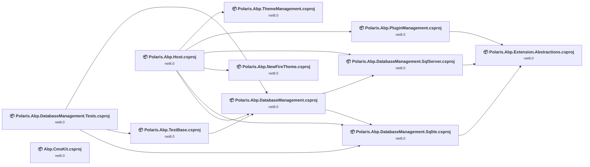

## Project Details

### src\host\Polaris.Abp.Host\Polaris.Abp.Host.csproj

#### Project Info

- **Current Target Framework:** net8.0
- **Proposed Target Framework:** net10.0
- **SDK-style**: True
- **Project Kind:** AspNetCore
- **Dependencies**: 6
- **Dependants**: 0
- **Number of Files**: 1827
- **Number of Files with Incidents**: 1
- **Lines of Code**: 660
- **Estimated LOC to modify**: 0+ (at least 0.0% of the project)

#### Dependency Graph

Legend:
📦 SDK-style project
⚙️ Classic project

```mermaid
flowchart TB
    subgraph current["Polaris.Abp.Host.csproj"]
        MAIN["<b>📦&nbsp;Polaris.Abp.Host.csproj</b><br/><small>net8.0</small>"]
        click MAIN "#srchostpolarisabphostpolarisabphostcsproj"
    end
    subgraph downstream["Dependencies (6"]
        P3["<b>📦&nbsp;Polaris.Abp.ThemeManagement.csproj</b><br/><small>net8.0</small>"]
        P2["<b>📦&nbsp;Polaris.Abp.PluginManagement.csproj</b><br/><small>net8.0</small>"]
        P6["<b>📦&nbsp;Polaris.Abp.DatabaseManagement.SqlServer.csproj</b><br/><small>net8.0</small>"]
        P4["<b>📦&nbsp;Polaris.Abp.NewFireTheme.csproj</b><br/><small>net8.0</small>"]
        P9["<b>📦&nbsp;Polaris.Abp.DatabaseManagement.Sqlite.csproj</b><br/><small>net8.0</small>"]
        P5["<b>📦&nbsp;Polaris.Abp.DatabaseManagement.csproj</b><br/><small>net8.0</small>"]
        click P3 "#srcmodulespolarisabpthememanagementpolarisabpthememanagementcsproj"
        click P2 "#srcmodulespolarisabppluginmanagementpolarisabppluginmanagementcsproj"
        click P6 "#srcmodulespolarisabpdatabasemanagementsqlserverpolarisabpdatabasemanagementsqlservercsproj"
        click P4 "#srcthemespolarisabpnewfirethemepolarisabpnewfirethemecsproj"
        click P9 "#srcmodulespolarisabpdatabasemanagementsqlitepolarisabpdatabasemanagementsqlitecsproj"
        click P5 "#srcmodulespolarisabpdatabasemanagementpolarisabpdatabasemanagementcsproj"
    end
    MAIN --> P3
    MAIN --> P2
    MAIN --> P6
    MAIN --> P4
    MAIN --> P9
    MAIN --> P5

```

### API Compatibility

| Category | Count | Impact |
| :--- | :---: | :--- |
| 🔴 Binary Incompatible | 0 | High - Require code changes |
| 🟡 Source Incompatible | 0 | Medium - Needs re-compilation and potential conflicting API error fixing |
| 🔵 Behavioral change | 0 | Low - Behavioral changes that may require testing at runtime |
| ✅ Compatible | 1280 |  |
| ***Total APIs Analyzed*** | ***1280*** |  |

### src\modules\Polaris.Abp.DatabaseManagement.Sqlite\Polaris.Abp.DatabaseManagement.Sqlite.csproj

#### Project Info

- **Current Target Framework:** net8.0
- **Proposed Target Framework:** net10.0
- **SDK-style**: True
- **Project Kind:** ClassLibrary
- **Dependencies**: 1
- **Dependants**: 3
- **Number of Files**: 2
- **Number of Files with Incidents**: 1
- **Lines of Code**: 40
- **Estimated LOC to modify**: 0+ (at least 0.0% of the project)

#### Dependency Graph

Legend:
📦 SDK-style project
⚙️ Classic project

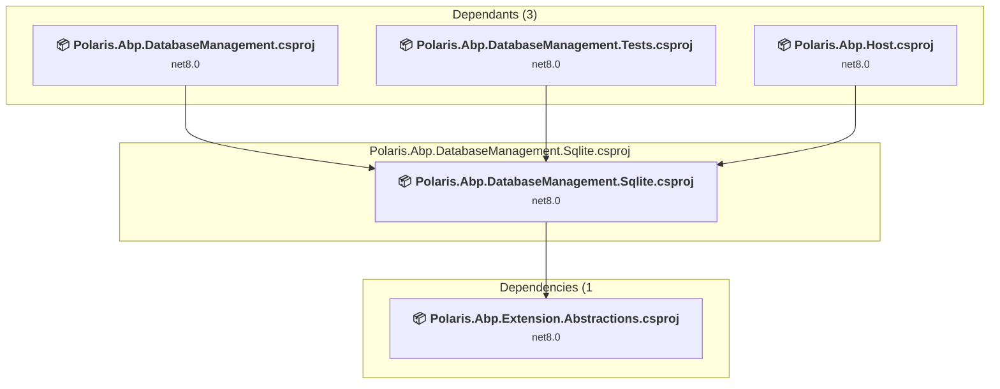

### API Compatibility

| Category | Count | Impact |
| :--- | :---: | :--- |
| 🔴 Binary Incompatible | 0 | High - Require code changes |
| 🟡 Source Incompatible | 0 | Medium - Needs re-compilation and potential conflicting API error fixing |
| 🔵 Behavioral change | 0 | Low - Behavioral changes that may require testing at runtime |
| ✅ Compatible | 27 |  |
| ***Total APIs Analyzed*** | ***27*** |  |

### src\modules\Polaris.Abp.DatabaseManagement.SqlServer\Polaris.Abp.DatabaseManagement.SqlServer.csproj

#### Project Info

- **Current Target Framework:** net8.0
- **Proposed Target Framework:** net10.0
- **SDK-style**: True
- **Project Kind:** ClassLibrary
- **Dependencies**: 1
- **Dependants**: 2
- **Number of Files**: 3
- **Number of Files with Incidents**: 1
- **Lines of Code**: 52
- **Estimated LOC to modify**: 0+ (at least 0.0% of the project)

#### Dependency Graph

Legend:
📦 SDK-style project
⚙️ Classic project

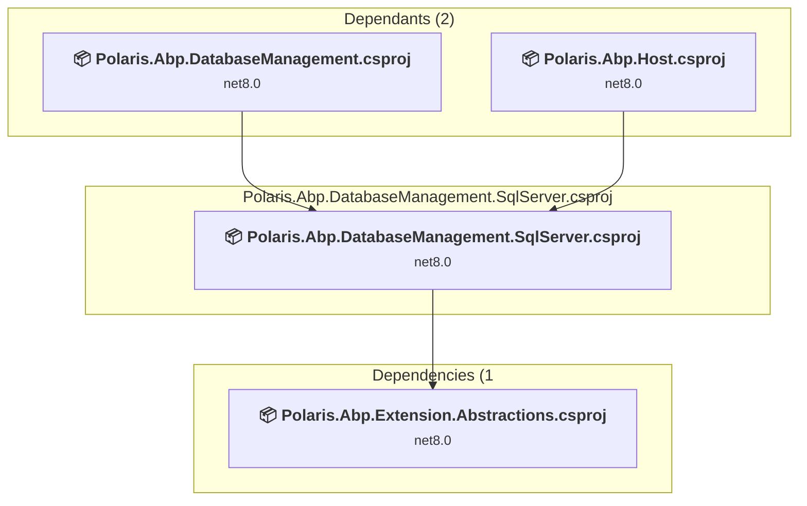

### API Compatibility

| Category | Count | Impact |
| :--- | :---: | :--- |
| 🔴 Binary Incompatible | 0 | High - Require code changes |
| 🟡 Source Incompatible | 0 | Medium - Needs re-compilation and potential conflicting API error fixing |
| 🔵 Behavioral change | 0 | Low - Behavioral changes that may require testing at runtime |
| ✅ Compatible | 35 |  |
| ***Total APIs Analyzed*** | ***35*** |  |

### src\modules\Polaris.Abp.DatabaseManagement\Polaris.Abp.DatabaseManagement.csproj

#### Project Info

- **Current Target Framework:** net8.0
- **Proposed Target Framework:** net10.0
- **SDK-style**: True
- **Project Kind:** ClassLibrary
- **Dependencies**: 2
- **Dependants**: 3
- **Number of Files**: 49
- **Number of Files with Incidents**: 1
- **Lines of Code**: 1801
- **Estimated LOC to modify**: 0+ (at least 0.0% of the project)

#### Dependency Graph

Legend:
📦 SDK-style project
⚙️ Classic project

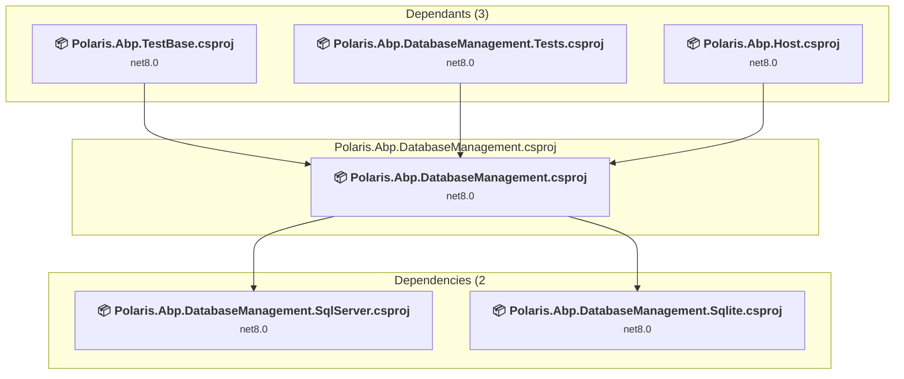

### API Compatibility

| Category | Count | Impact |
| :--- | :---: | :--- |
| 🔴 Binary Incompatible | 0 | High - Require code changes |
| 🟡 Source Incompatible | 0 | Medium - Needs re-compilation and potential conflicting API error fixing |
| 🔵 Behavioral change | 0 | Low - Behavioral changes that may require testing at runtime |
| ✅ Compatible | 5809 |  |
| ***Total APIs Analyzed*** | ***5809*** |  |

### src\modules\Polaris.Abp.Extension.Abstractions\Polaris.Abp.Extension.Abstractions.csproj

#### Project Info

- **Current Target Framework:** net8.0
- **Proposed Target Framework:** net10.0
- **SDK-style**: True
- **Project Kind:** ClassLibrary
- **Dependencies**: 0
- **Dependants**: 3
- **Number of Files**: 8
- **Number of Files with Incidents**: 1
- **Lines of Code**: 79
- **Estimated LOC to modify**: 0+ (at least 0.0% of the project)

#### Dependency Graph

Legend:
📦 SDK-style project
⚙️ Classic project

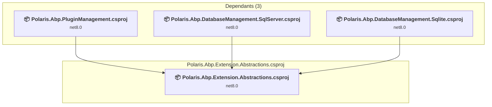

### API Compatibility

| Category | Count | Impact |
| :--- | :---: | :--- |
| 🔴 Binary Incompatible | 0 | High - Require code changes |
| 🟡 Source Incompatible | 0 | Medium - Needs re-compilation and potential conflicting API error fixing |
| 🔵 Behavioral change | 0 | Low - Behavioral changes that may require testing at runtime |
| ✅ Compatible | 49 |  |
| ***Total APIs Analyzed*** | ***49*** |  |

### src\modules\Polaris.Abp.PluginManagement\Polaris.Abp.PluginManagement.csproj

#### Project Info

- **Current Target Framework:** net8.0
- **Proposed Target Framework:** net10.0
- **SDK-style**: True
- **Project Kind:** ClassLibrary
- **Dependencies**: 1
- **Dependants**: 1
- **Number of Files**: 48
- **Number of Files with Incidents**: 1
- **Lines of Code**: 1698
- **Estimated LOC to modify**: 0+ (at least 0.0% of the project)

#### Dependency Graph

Legend:
📦 SDK-style project
⚙️ Classic project

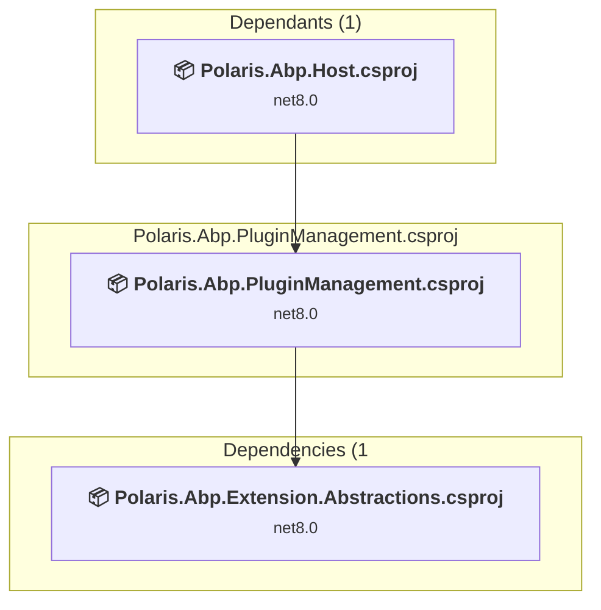

### API Compatibility

| Category | Count | Impact |
| :--- | :---: | :--- |
| 🔴 Binary Incompatible | 0 | High - Require code changes |
| 🟡 Source Incompatible | 0 | Medium - Needs re-compilation and potential conflicting API error fixing |
| 🔵 Behavioral change | 0 | Low - Behavioral changes that may require testing at runtime |
| ✅ Compatible | 2515 |  |
| ***Total APIs Analyzed*** | ***2515*** |  |

### src\modules\Polaris.Abp.ThemeManagement\Polaris.Abp.ThemeManagement.csproj

#### Project Info

- **Current Target Framework:** net8.0
- **Proposed Target Framework:** net10.0
- **SDK-style**: True
- **Project Kind:** ClassLibrary
- **Dependencies**: 0
- **Dependants**: 1
- **Number of Files**: 38
- **Number of Files with Incidents**: 1
- **Lines of Code**: 644
- **Estimated LOC to modify**: 0+ (at least 0.0% of the project)

#### Dependency Graph

Legend:
📦 SDK-style project
⚙️ Classic project

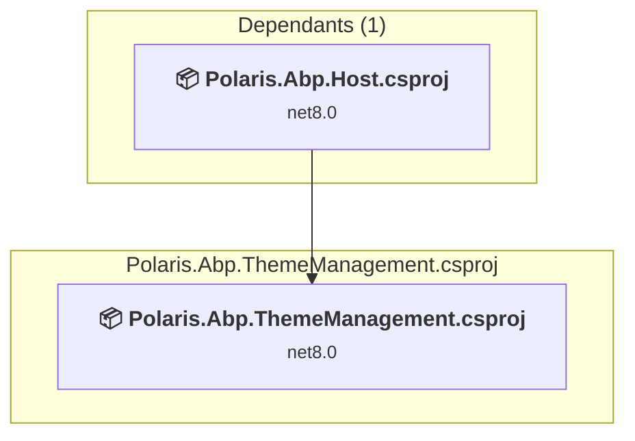

### API Compatibility

| Category | Count | Impact |
| :--- | :---: | :--- |
| 🔴 Binary Incompatible | 0 | High - Require code changes |
| 🟡 Source Incompatible | 0 | Medium - Needs re-compilation and potential conflicting API error fixing |
| 🔵 Behavioral change | 0 | Low - Behavioral changes that may require testing at runtime |
| ✅ Compatible | 1504 |  |
| ***Total APIs Analyzed*** | ***1504*** |  |

### src\samples\Abp.CmsKit\Abp.CmsKit.csproj

#### Project Info

- **Current Target Framework:** net8.0
- **Proposed Target Framework:** net10.0
- **SDK-style**: True
- **Project Kind:** ClassLibrary
- **Dependencies**: 0
- **Dependants**: 0
- **Number of Files**: 1247
- **Number of Files with Incidents**: 1
- **Lines of Code**: 83
- **Estimated LOC to modify**: 0+ (at least 0.0% of the project)

#### Dependency Graph

Legend:
📦 SDK-style project
⚙️ Classic project

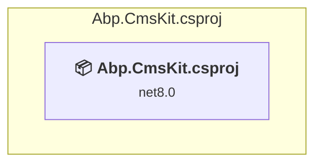

### API Compatibility

| Category | Count | Impact |
| :--- | :---: | :--- |
| 🔴 Binary Incompatible | 0 | High - Require code changes |
| 🟡 Source Incompatible | 0 | Medium - Needs re-compilation and potential conflicting API error fixing |
| 🔵 Behavioral change | 0 | Low - Behavioral changes that may require testing at runtime |
| ✅ Compatible | 86 |  |
| ***Total APIs Analyzed*** | ***86*** |  |

### src\themes\Polaris.Abp.NewFireTheme\Polaris.Abp.NewFireTheme.csproj

#### Project Info

- **Current Target Framework:** net8.0
- **Proposed Target Framework:** net10.0
- **SDK-style**: True
- **Project Kind:** ClassLibrary
- **Dependencies**: 0
- **Dependants**: 1
- **Number of Files**: 39
- **Number of Files with Incidents**: 1
- **Lines of Code**: 1011
- **Estimated LOC to modify**: 0+ (at least 0.0% of the project)

#### Dependency Graph

Legend:
📦 SDK-style project
⚙️ Classic project

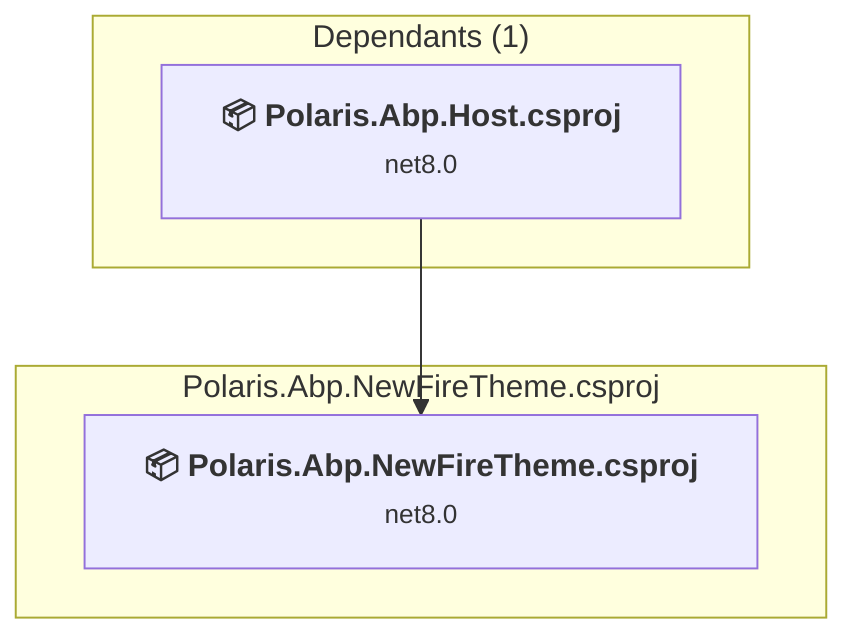

### API Compatibility

| Category | Count | Impact |
| :--- | :---: | :--- |
| 🔴 Binary Incompatible | 0 | High - Require code changes |
| 🟡 Source Incompatible | 0 | Medium - Needs re-compilation and potential conflicting API error fixing |
| 🔵 Behavioral change | 0 | Low - Behavioral changes that may require testing at runtime |
| ✅ Compatible | 4139 |  |
| ***Total APIs Analyzed*** | ***4139*** |  |

### test\Polaris.Abp.DatabaseManagement.Tests\Polaris.Abp.DatabaseManagement.Tests.csproj

#### Project Info

- **Current Target Framework:** net8.0
- **Proposed Target Framework:** net10.0
- **SDK-style**: True
- **Project Kind:** DotNetCoreApp
- **Dependencies**: 3
- **Dependants**: 0
- **Number of Files**: 5
- **Number of Files with Incidents**: 1
- **Lines of Code**: 216
- **Estimated LOC to modify**: 0+ (at least 0.0% of the project)

#### Dependency Graph

Legend:
📦 SDK-style project
⚙️ Classic project

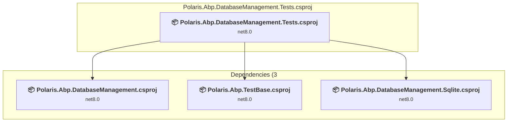

### API Compatibility

| Category | Count | Impact |
| :--- | :---: | :--- |
| 🔴 Binary Incompatible | 0 | High - Require code changes |
| 🟡 Source Incompatible | 0 | Medium - Needs re-compilation and potential conflicting API error fixing |
| 🔵 Behavioral change | 0 | Low - Behavioral changes that may require testing at runtime |
| ✅ Compatible | 197 |  |
| ***Total APIs Analyzed*** | ***197*** |  |

### test\Polaris.Abp.TestBase\Polaris.Abp.TestBase.csproj

#### Project Info

- **Current Target Framework:** net8.0
- **Proposed Target Framework:** net10.0
- **SDK-style**: True
- **Project Kind:** DotNetCoreApp
- **Dependencies**: 1
- **Dependants**: 1
- **Number of Files**: 8
- **Number of Files with Incidents**: 1
- **Lines of Code**: 133
- **Estimated LOC to modify**: 0+ (at least 0.0% of the project)

#### Dependency Graph

Legend:
📦 SDK-style project
⚙️ Classic project

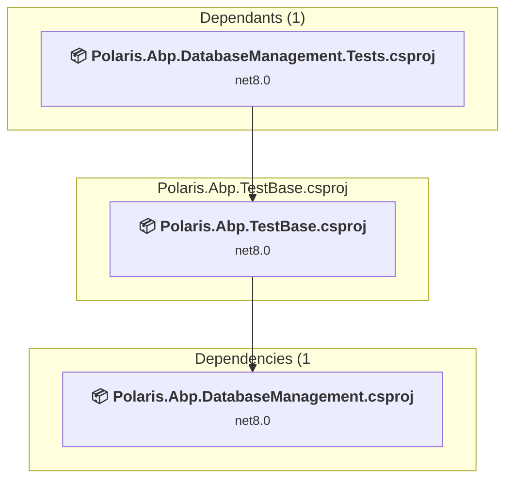

### API Compatibility

| Category | Count | Impact |
| :--- | :---: | :--- |
| 🔴 Binary Incompatible | 0 | High - Require code changes |
| 🟡 Source Incompatible | 0 | Medium - Needs re-compilation and potential conflicting API error fixing |
| 🔵 Behavioral change | 0 | Low - Behavioral changes that may require testing at runtime |
| ✅ Compatible | 103 |  |
| ***Total APIs Analyzed*** | ***103*** |  |

